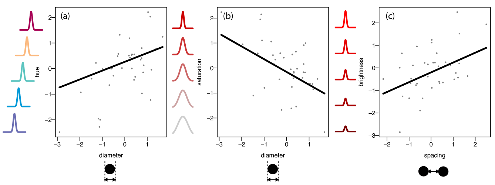
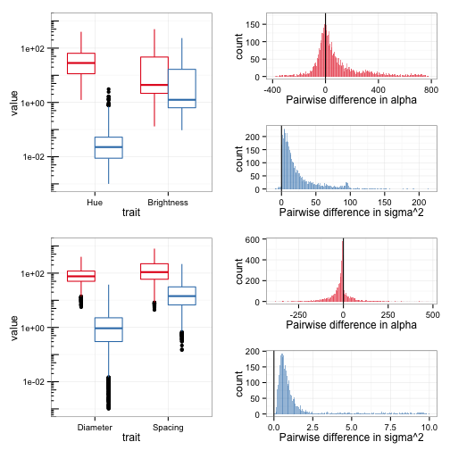

# Modular color evolution facilitated by a complex nanostructure

Eliason, C. M., Maia, R. M., Shawkey, M. D.

## TODO

- [ ] Add discussion of variance-time plots
- [x] Add histogram of parameter differences for Fig. S6

## Abstract

Understanding how complex traits diversify remains an important question in evolutionary biology. Extensive evidence suggests that the genetic and developmental architecture of complex traits can channel evolutionary change. However, in many cases selection acts on functional properties of complex traits rather than directly on morphology. Thus, with functional traits, the way that form maps to function can be crucial in understanding how such traits respond to selection. Feather colors in birds are among the most diverse phenotypes in nature and can be produced either by selective light absorption by pigments (pigment-based colors), or light scattering from nanoscale structures varying in refractive index (structural colors). Based on the deterministic association between structural color and its producing components, an increase in the number of tunable morphological parameters may increase the number of free optical parameters. Such innovations have been shown to result in accelerated color diversification and the opportunity to occupy novel areas of colorspace. However, the mechanisms by which these flexible templates might favor or channel the evolution of colors relies on understanding i) how added morphological complexity enables the evolution of multiple, independent evolutionary modules and ii) how these structural modules map to color attributes, both of which remain unknown in an evolutionary context. Many species of dabbling ducks (Anatini) have a remarkably conspicuous patch of colorful plumage in their wings (the speculum), which is often momomorphic (found in both males and females) and in most species is iridescent. These gaudy plumage patches vary considerably in color and have been shown in some species to be sexually-selected and used as visual signals in mate attraction and male-male competition signals. The structure responsible for producing these iridescent speculum colors is a 2-dimensional photonic crystal formed by the arrangement of small (100-200 nm) melanin granules (melanosomes) into a hexagonal pattern. Here, we ask how this complex template affects the independent variation (evolvability) of color attributes. Using a combination of electron microscopy, reflectance spectrophotometry, and multivariate comparative methods, we show that morphological complexity causes functional decoupling among color variables, allowing them to evolve independently and at different rates. By explicitly studying evolutionary trends in both form and function, our results demonstrate that color evolvability is facilitated by the functional architecture of the system rather than covariation among morphological traits (e.g., due to shared genetic or developmental pathways). These results are important because they show how internal features of organisms (e.g., innovations in the form-function map) relate to macroevolutionary patterns of phenotypic diversity, and therefore might help explain why some clades are more color-diverse than others.

## Introduction

<!--RM: I think this first paragraph of the intro needs some work. The first sentence is talking about things relevant at the population level, then jumps to macro examples. Maybe lead with more focus on form-function, how selection acts at the function level, etc-->

<!--RM: "S" stands for replacement suggestion -->

Evolution, either by selection or drift, requires heritable phenotypic variation {Futuyma}. Complex morphological traits like the jaws of cichlids {Liem?} or mandibles of mice {ref} (maybe beetle horns?) are characterized by having multiple interacting component parts (e.g., structural, morphological), which must act in concert for the trait to function optimally. <!-- RM these two first sentences are not connected in any way, I can't seem to make the link on this abrupt jump… --> Therefore, complex traits are likely to display greater potential for phenotypic variation than simple traits with fewer parameters {Vermeij 1973}. In nature, selection often acts on functional properties of complex traits rather than directly on morphology. For example, sexually selected song characteristics in reed warblers are functional properties of the vocal apparatus {Hasselquist et al. 1996}. By contrast, sexual selection on tail length in widowbirds acts directly on morphology {Andersson 1992}). <!--RM: the point you are making is that selection often works on F not M, but you give one example each (equal weights). I'd also contend SS on tail length is M only. Also song example might not be the best one since it has strong behavioral/learning components (ie 2 spp w/ same vocal apparatus can sing entirely different songs for reasons other than FM mapping). Perhaps better to lead with an ecological example not sexually selected? --> With functional traits, the way that form maps to function can be important in understanding how a trait responds to selection (i.e. its evolvability; {Wainwright 2007}).

<!-- Something about the difficulty of studying these in a SS context? -->

<!-- Comparing different form-function maps - In simple traits (1 parameter), tradeoffs are present so less evolvable. More complex traits often have complex form-function relationships that can enhance evolvability. You can have a complex morphology, but all produce same function (many-to-one), or all independent functions (many-to-many). Thus, it is important to understand the form-function map to understand how functional properties can evolve. - Proximate studies of the form-function map can help explain differences in functional and morphological diversity among animal groups (e.g., Hulsey & Wainwright {2002} found that morphological and mechanical diversity were decoupled in XX).  -->

Color is a well-studied functional property of the metazoan integument, determining organismal performance in tasks such as camouflage, thermoregulation, and visual communication {ref}.  <!-- Most studies focus on external forces (selection) in driving divergence. However, internal features of organisms (e.g., developmental constraints, form-function relationships) may also influence phenotypic divergence. Evolution needs variation, thus traits that produce variation should promote evolutionary divergence. BUT mechanism may also be  mportant. --> Color is a multidimensional trait commonly described by three optical parameters (hue, saturation and brightness) that summarize how light is reflected across a visible range and how it is processed by the viewer. Depending on the mechanisms responsible for producing a color, these parameters may vary independently or be strongly linked {ref}. For example, pigments of the carotenoid family absorb light in the blue-green range (400-500 nm), with each pigment abosrbing maximally at a different wavelength. Therefore, in the case of carotenoid-based colors, hue (the relative proportion of long to short wavelengths of light) is determined by which carotenoid pigment (and where in the spectrum it absorbs maximally, making it "yellower" or "redder") is deposited in the feather (or the relative amounts of carotenoid mixtures), and therefore is more likely to vary independently from brightness (how much light is reflected) and saturation (color purity), which instead are mostly controlled by the amount of that pigment deposited in the feather and are thus more strongly correlated {ref}.

<!-- Bird color mechanisms -->
Birds are well-known for their diverse plumage colors, and many of these gaudy colors are thought to have evolved primarily through sexual selection {Andersson 1994}. Feather colors can be produced either by selective light absorption by pigments that birds deposit in their feathers (pigment-based colors, described above) or light scattering from nanoscale  structures varying in refractive index (structural colors). In the latter case, color properties are determined by the size, shape and arrangement of its nanostructural components, and how they interact with light {ref}. In other words, its functional (optical) properties are intrinsically linked to the structural characteristics of the underlying morphology, such that variation in color attributes can be mapped to variations in the morphology of the color-producing nanostructure. 

<!-- Hypothesis --> 
Based on this deterministic association between color and its producing components, we might expect that an increase in the number of tunable morphological parameters in color-producing nanostructures may increase the number of free optical parameters. For example, one of the most common structural color-producing mechanisms found in bird feathers is a thin film of keratin layered over packed rod-shaped melanin-containing organelles (melanosomes) {ref}. Given that melanin is highly absorbtive accross the entire human and avian visible spectrum and that the refractive index of keratin and melanin are defined by their material properties, the only way this structural template can vary to produce different colors is by varying the thickness of the keratin cortex. Therefore, this structure results in a single major axis of variation in color, with hue variation tracking cortex thickness {bowerbird, grackles}, and variation in brightness and saturation being constrained by the lack of tunable structural components <!-- RM: my wording is bad but you get the idea -->. However, modifications to this template open the possibility of additional, potentially independent, axes of morphological variation with direct consequences to color variation {starlings}. Thus, structural colors are an excellent system for studying how the functional architecture of complex traits influences phenotypic evolvability.

Many species of ducks (anatidae etcetc) have a remarkably conspicuous patch of colorful plumage in their wings (the speculum), which is often dimorphic (found only in males) and in several (most?) species is iridescent. These gaudy plumage patches vary considerably in color {eliason? other} and have been shown in some species to be sexually-selected and used as visual signals in mate attraction and male-male competition signals {ref}. The structure responsible for producing these iridescent speculum colors is a 2-dimensional photonic crystal (PC) formed by the arrangement of small (100-200 nm) melanosomes into a hexagonal pattern {Eliason 2012}. PCs are therefore complex structures made of repeating subunits that cause fluctuations in refractive index. This periodic variation in refractive index, along with the small size of subunits (near the wavelengths of visible light, 400-700 nm), causes certain wavelength of light to be reflected more strongly than others (through constructive interference), producing visible color. <!--RM: maybe too late in the paper to describe this fundamental aspect of structural colors? --> <!-- This type of structure is flexible, producing diverse iridescent colors across the bird-visible spectrum through only minor changes in the size or spacing of melanosomes {Eliason 2012}. --> Compared to simple structures like the thin-films described above, PCs in ducks are complex with multiple parameters determining the structural form (e.g., the size and spacing of melanosomes) {Eliason 2012, Joannopoulos 2008} and therefore present the potential for multiple, independent modular subuints controlling different aspects of speculum color {ref?}.<!-- Add in that previous results suggest independent contributions of spacing and density to color properties hue and saturation/brightness? --> Such innovations have been shown to result in accelerated color diversification and the opportunity to occupy novel areas of colorspace {starlings}. However, the mechanisms by which these novel templates may favor or channel the evolution of colors relies on i) how added morphological complexity enables the evolution of multiple, independent evolutionary modules, and ii) how these structural modules map to color attributes, which remain unknown ()in an evolutionary context?). 

Here we ask how this increased morphological complexity affects the independent variation (and thus the evolvability) of color attributes. We hypothesized that color evolvability is influenced by the way that morphology maps to color. This hypothesis makes the following predictions: i) color variation will be explained by variation in morphology, ii) "modular" (functionally independent) color traits will evolve independently and at different rates, and iii) rates of color evolution parallel those in underlying functional morphology.

## Methods

### Sampling species and reconstructing phylogenetic relationships

Of the 54 recognized species in the Anatini sub-family {IOC ref}, we obtained samples from the 44 with DNA sequences available from GenBank for the molecular phylogenetic reconstruction. We obtained morphological and color measurements from skin specimens from the Field Museum of Natural History (FMNH) and the University of Michigan Museum of Zoology (UMMZ) of all species except for four species that had non-iridescent wing patches (_Tachyeres pteneres_, _A. georgica_, _A. sibilatrix_, and _A. strepera_) and two (_Anas bernieri_ and _A. smithii_) which had no suitable specimens at the collections, for a total of 38 (CHECK) species with both phylogenetic and phenotypic data.

We estimated a time-calibrated phylogeny for dabbling ducks using published mtDNA sequences (cytochrome b oxidase, NADH dehydrogenase; {refs}) and an uncorrelated relaxed clock algorithm implemented in the program BEAST 1.7.4 {Drummond}. We used available fossil data and exponential priors to place constraints on the root age and divergence times for six internal nodes {REFS}. We used a starting tree estimated in MrBayes v. 3.1.2 {ref}. <!-- for the starting tree or the whole analysis? (paraemters) --> <!-- We assumed a GTR model for the concatenated DNA dataset, invariant sites, gamma-distribution for the rate heterogeneity {Yang 1994 cited in Alfaro 2007}. We specified a normal distribution for the substitution rate (mean=0.01145, sd=0.0024) based on previous results in birds {Weir et al. 2008}. NEED TO READ UP ON THIS MORE...  Speciation was assumed to follow a Yule process {ref}. --> We ran five separate analyses in BEAST for 10 million generations each, sampling every 10000 generations, and checked that these independent analyses reached stationarity at the same region of parameter space using Tracer 1.5 {ref}. For comparative analyses, we obtained a maximum clade credibility (MCC) summary tree, and obtained a sample of 500 trees from the posterior distribution in order to incorporate phylogenetic uncertainty in the evolutionary model estimates. All trees were made time-proportional by scaling to a total depth of one for further analyses. Clade names within Anatidae follow the terminology in Johnson (1999).

### Measuring spectral reflectance and quantifying color

To quantify color, we measured spectral reflectance of intact wing patches at coincident normal geometry (with light and measurement bifurcated probe perpendicular to the feather surface) from 300-700 nm using a spectrophotometer and attached Xenon light source (Avantes Inc., Broomfield, CO, USA). We took three measurements from the right wing of 1-5 males per species, completely removing the probe between measurements and haphazardly selecting a different spot from the speculum. In some cases, only one wing was available for measurement, thus we had to measure the left wing of these males. After measuring reflectance, we smoothed the spectra with local regression (LOESS) in `R` to minimize electrical noise from the spectrophotometer and increase the accuracy of color variable calculation.

From the processed spectra, we characterized speculum color based on three attributes from the reflectance spectra: hue (how red or blue a color is, determined as the wavelength of the primary reflectance peak), saturation (how pure or vivid a color is, represented by the half-width of the main reflectance peak at 50% of peak reflectance; see ESM for details), and brightness (how much light is reflected, calculated as the maximum reflectance of the main peak). These three color variables were chosen because they allow for direct comparison with optical model predictions in photonic crystals {Eliason 2012; Joannopoulos 2008}. Because brightness is highly sensitive to variation in alignment of the spectrophotometer (ref), we retained the brightest of the three spectra per bird for further analyses {Meadows?}. All color analyses were performed in the `R` package `pavo` {Maia 2013}.

### Quantifying color-producing morphology

The structural features of photonic crystals responsible for producing color in visible wavelengths are at the nanoscale, and therefore we used transmission electron microscopy (TEM) micrographs from barbule cross-sections to quantify relevant morphological parameters (see ESM for TEM protocol). We then used the  ImageJ software {Abramoff 2004} to measure i) the diameter of melanosomes (_d_), ii) the separation between melanosomes (_t_), and iii) the number of layers in a melanosome stack measured perpendicular to the barbule surface (_l_; see Fig. X for measurement schematic). These parameters are sufficient to describe and model color production by 2-dimensional photonic crystals and have been demonstrated to control color variation in duck specula {Eliason 2012}. Although the keratin layer at the outside of barbules (cortex) can theoretically affect color, we previously showed that the main reflectance peak is controlled primarily by the underlying photonic crystal {Eliason 2012}, thus we did not include the cortex thickness variable in our analyses.

We took measurements from 10 haphazardly chosen regions within 1-3 barbules per species to account for potential non-independence in the sizes of adjacent melanosomes. We natural log-transformed all morphological variables and computed species means for statistical analyses. This transformation allowed us to compare evolutionary rates among traits with different length scales by representing variation in proportional change in units of _e_ (2.7) {ref}.

### Modeling character evolution

To explore the evolutionary mode of color and morphology traits, we fit Brownian motion (BM) and Ornstein-Uhlenbeck (OU) models of character evolution separatedly to both sets of taits using maximum likelihood (ML) with the `R` package `ouch` {Butler 2004}. We further tested if models considering correlations between traits within a set (that is, among color variables and among morphological variables separatedly) outperformed models where traits were considered to be uncorrelated. 

We tested the power to differentiate between BM and OU models, as well as univariate and multivariate OU models, using a phylogenetic Monte Carlo (pmc) approach {Boettiger 2012}. Briefly, we estimated ML parameters for each posterior tree in `ouch`, then randomly sampled one of these trees (and its respective estimates) to simulate traits evoling along that phylogeny under the null and test models. We then re-estimated ML parameters for the simulated datasets under each model and calculated the deviance as $\delta = 2*(\text{log}\mathcal{L}_\text{null} - \text{log}\mathcal{L}_\text{test})$. We repeated this simulation process 1000 times to obtain deviance distributions considering model and phylogenetic uncertainty. Comparing the overlap in these distributions gives the power to distinguish between the two models, and comparing the observed deviance to the null distribution gives the probability of observing a value equal to or more extreme than that obtained from data simulated under the null model (i.e. a _p_-value given the null hypothesis; {Boettiger 2012}).

### Linking form to function

To test our hypothesis that the form-function map biases the direction and rate of color evolution, we quantified the relationship between feather morphology and color using phylogenetic generalized least squares (PGLS) multiple regression. We accounted for phylogenetic effects on trait covariation (?) under an OU process using the `corMartins` function in the `geiger` package {Martins and Hansen 1997}. Phylogenetic effects are accounted for in the OU model by the phylogenetic half-life, which is inversely proportional to twice the attraction parameter $alpha$ {ref}, and therefore allowed to vary depending on the ML estimate of the $alpha$ parameter. To account for phylogenetic uncertainty in parameter estimates, we ran PGLS models for each color variable on all 500 posterior trees, and retained parameter estimates as well as their standard deviations. The sum of the among-tree and average within-tree variance in parameter estimates was then used to statistically test for the effect of the different response variables in the models. All PGLS analyses were conducted in `R` using the packages `nlme` {ref} and `ape` {Paradis 2008?}. We used multivariate Q-Q plots to assess normality and transformed variables when necessary (see ESM for details). Variables were centered and scaled by their standard deviations prior to analysis to obtain standardized regression coefficients {Schielzeth 2010}.

### Calculating evolutionary rates and modularity

Evolutionary rates describe how quickly variation accumulates over a given period of time {Martins 1994}. Under a Brownian motion model, variation increases linearly as a function of $\sigma^2$ and time. By contrast, under an OU model, the time-variance relationship is nonlinear: variation in traits increases at first, but as a result of the action of the attraction parameter $alpha$, the rate of variance accumulation slows down, such that given sufficient time it will reach a plateau and be constant over time {ref}. Evolutionarily, this is often interpreted as a balancing out of variance-generating mechanisms (drift, mutation) and variance-restraining forces (selection, developmental constraints) {Hansen 1997, Martins et al. 2002}.

For this reason, rates of trait evolution cannot be inferred from $\sigma^2$ alone if the model that best describes trait evolution is any other than a Brownian Motion model {ref, slater?}. However, if we interpret rates of evolution as the average rate of variance accumulated over the evolutionary history of a lineage, from its root ancestor up to the present time, we can estimate rates from an OU process as a function of $\sigma^2$, $\alpha$, and time. <!-- assuming a long enough time has passed, the rate of change will be zero and the stationary covariance matrix __V__  --> To do this, we used published equations {Bartoczek et al. 2012, Hansen and Martins 1996} to calculate the evolutionary variance-covariance matrix __V__ under an OU process (see equation B.8 in Bartoczek 2012). We then used __V__ to compare the rates at which different traits have evolved (diagonals of __V__, comparable to the rate metric $\omega$ in {Hunt 2012}) and test whether different pairs of traits evolve independently or in a correlated fashion (off-diagonals of __V__). We further examined whether the OU process had reached stationarity (i.e. whether $\sigma^2$ and $\alpha$ cancel each other out <!-- RM 'cancel each other out' gives me the feeling that ssq/2a = 0, which is not the case is it --> or, if not, whether the clade would be predicted to accumulate further phenotypic variation given sufficient time) by simulating variance as a function of time for the estimated $\sigma^2$ and $\alpha$ values, using EQUATION XX in REF XXX.

To calculate confidence intervals for elements of __V__, we used the pmc approach described above to simulate evolution under the best fitting OU model. To test for correlated evolution, we evaluated whether the 95% confidence intervals of trait covariance estimates obtained from the pmc routine overlapped zero. To test if triats evolved as interdependent modules or if differences in evolutionary rates among them exist, we calculated pairwise contrasts in evolutionary rates for all pairwise combinations among color and morphology traits (separatedly?). We assessed significance by examining whether the 95% confidence intervals of these contrasts overlapped zero (after applying sequential Bonferroni correction to account for multiple tests {REF?}). To reduce the computational burden when obtaining estimates under the different evolutionary scenarios, we determined the number of pmc simulations sufficient to capture variation in rate difference estimates using a rarefaction of variance analysis {see Claramunt 2010 for `R` code}. Briefly, we <!-- (calculated the standard deviation of replicate samples drawn from the full number of simulations ... WORKING ON )--> randomly selected samples of a given size (ranging from 0-max MC sample size, in increments of 20 <!-- RM don't understand-->), repeated this for 100 replicates for each sample size, calculated mean SD across replicates, and finally plotted mean SD versus sample size. A leveling off of the resulting rarefaction curve indicates increasing sample size will have little effect on the captured variation, and therefore additional simulations were not necessary to describe uncertainty in estimated parameters.

### Measurement error and outlier sensitivity

Comparisons of evolutionary rates among different phenotypic traits are prone to measurement error (ME) {Ives, Revell, Adams}. Because TEM is both time and cost prohibitive, it is examining barbule morphology for many individuals in all species needed to compute ME is unfeasible. Therefore, following {Harmon et al. 2010}, we considered an estimate for interspecific variation of color and morphological traits for one of the species (mallard, _Anas platyrhynchos_) which had been sampled densely for a separate study, running all the analyses described above incorporating this estimate of measurement error. Although this assumes similar measurement error accross all species, calculating rates with and without ME allowed us to evaluate the relative sensitivity of different traits to measurement error, and therefore to determine whether our results are robust to these effects {Harmon et al. 2010}.

<!-- CE: Raf, do you think we need to do this? -->

<!-- We also ran analyses at 0.5X and 2X the observed ME to see how variation in ME would influence our results (this is what Luke Harmon et al. did in their 2010 paper). -->

Bivariate plots of morphological and optical variables revealed two potential outlier species: _A. aucklandica_ (with a very broad reflectance peak; Fig. S1) and _A. rubripes_ (smallest melanosome diameter and spacing; Fig. S2). To assess whether these values affected our results, we pruned them from the phylogenies and re-ran all analyses.

## Results

### Phylogeny

All chains reached stationarity around the same optimal likelihood value and all parameters had ESS higher than 116. The maximum clade credibility (MCC) tree was very similar to Johnson (1999) and recapitulated most of the topology of Gonzalez et al. (2009), with slight differences. For example, we recovered _A. hottentota_ as basal to the silver teal and blue-winged duck clades (posterior support 100%), differing from Gonzalez et al. (2009) who placed the species within the silver teal clade and sister to the blue-winged clade <!-- RM Any other studies support the topology you found? -->. We also recovered _A. undulata_ as basal to the remaining mallard clade (100% posterior support) rather than _A. melleri_, and _A. erythrorhyncha_ was basal to the pintail clade (100% node support), in agreement with Johnson (1999) but diverging from Gonzalez et al. (2009). Despite these minor differences in topology for our MCC tree, our use of posterior samples in comparative analyses accounts for such uncertainty. <!-- RM Well not really, if all conflicting nodes had 100% Support! CE True, not in these specific instances, but in general. -->

### Form-function relationships (mapping?)

All duck species with iridescent specula sampled had melanosomes organized in hexagonal arrays characteristic of the two-dimensional photonic crystal described previously {Eliason 2012}. Melanosome diameter ranged from 90 - 180 nm, spacing between adjacent melanosomes varied from 18 - 87 nm, and the number of layers at the surface of barbules ranged from 4-8. Hue spanned from blue to red (463 - 647 nm), saturation ranged from 32 - 69 nm, and brightness varied from 5 - 70%.

Melanosome diameter had a significant positive effect on hue (phylogenetic generalized least squares regression, PGLS: $\beta$ = 0.36 ± 0.18, _t_ = 2.07, _p_ = 0.045; Figure 1a), as well as a significant negative effect on saturation ($\beta = -0.50$ ± 0.18, _t_ = -2.77, _p_ = 0.0089; Figure 1b) but did not significantly influence brightness (PGLS, $\beta$ = -0.35 ± 0.20, _t_ = -1.77, _p_ = 0.085). Melanosome spacing had a significant positive effect on brightness (PGLS, $\beta$ = 0.43 ± 0.16, _t_ = 2.69, _p_ = 0.011; Fig. 1c) but did not significantly predict hue ($\beta$ = -0.064 ± 0.15, _t_ = -0.42, _p_ = 0.67) or saturation ($\beta$ = 0.22 ± -0.16, _t_ = 1.37, _p_ = 0.18; Fig. 1). Therefore, species with larger melanosomes tend to have redder, less saturated colors, whereas species with more open hexagonal arrays (that is, greater distance between its melanosomes) had brighter colors. The number of melanosome layers did not significantly predict any of the considered color variables. 

Removing _A. aucklandica_ (the first potential multivariate outlier) did not affect the magnitude or direction of the relationships, but the effect of diameter on hue became only marginally significant ($\beta$ = 0.34, _t_ = 1.93, _p_ = 0.06). Removing the other potential outlier (_A. rubripes_) did not qualitatively affect any of the results.

### Modularity and evolvability

The multivariate OU model was strongly preferred over the Brownian motion (BM) model for both morphological and optical traits (both _p_ < 0.001). `pmc` simulations showed that there was adequate power to tell these models apart, as there was no overlap in the distribution of deviances obtained by comparing models from traits  simulated under BM or OU models (Fig. S3a,b). We further compared multivariate and univariate OU models (i.e. off-diagonal elements of $\sigma^2$ and $\alpha$ set equal to zero) and found strong support for the multivariate model for both suites of traits (both _p_ < 0.001; power = 99.3% and 98.0% for color and morphological traits, respectively; Fig. S3c,d). for the multivariate model, rarefaction (of variance?) analyses <!-- RM check name --> showed that approximately 5000 simulations captured the variation in estimates for both diagonal (Fig. S4) and off-diagonal components of __V__ (Fig. S5). We therefore used 5000 simulations in following analyses.

Under the multivariate OU model, no morphological traits were significantly correlated, as all 95% confidence intervals overlapped zero (Fig. 2a). Removing _A. aucklandica_ from the analyses strengthened correlations between traits, but only qualitatively affected the relationship between diameter and spacing, making it significant (_r_ = 0.40 [0.07, 0.67]). Removing the second outlier _A. rubripes_ resulted again in a nonsignificant relationship between diameter and spacing. Saturation was positively correlated with hue (_r_ = 0.43 [0.08, 0.70]) and negatively correlated with brightness (_r_ = -0.43 [-0.78, -0.11]). Brightness and hue were not significantly correlated (_r_ = 0.18 [-0.18, 0.52]). 

When comparing evolutionary rates, melanosome spacing evolved significantly faster (~5.5X) than the size of melanosomes or the number of layers, with no significant differences between the rates of the latter two (ratio = 1.9; Fig. 3a). The three color traits had significantly different evolutionary rates, with brightness evolving significantly faster than hue (~73X) and saturation (~17X), and saturation evolving ~4X faster than hue (Fig. 3b). Both color and morphology rate comparisons were unaffected by the removal of outliers. 

Evolutionary rates under the OU model represent a ratio of the evolutionary variance $\sigma^2$ by the attraction parameter $\alpha$ {EQUATION XX IN REF XX OR METHODS IN THIS PAPER}. Therefore, variable rates can emerge as a result from differences in either of these parameters. Comparing these parameters individually showed that the observed increase in divergence rate for spacing and brightness compared to diameter and hue is due to differences in $\sigma^2$ rather than $\alpha$ (Fig. S6).

Patterns of disparity among morphological traits paralleled those in color. Specifically, melanosome spacing (and consequently brightness) evolved faster than melanosome diameter (and consequently hue and saturation). Hue and saturation were positively correlated (Fig. 2b). <!-- RM THIS IS DISCUSSION This is likely because both of these variables stem from a common underlying morphological trait (melanosome diameter), thus changes in diameter would produce correlated changes in either color trait. --> <!-- RM I don't understand, the whole following section seems to be just repeating the results from two paragraphs above? In any way, this seems a bit better written --> Hue and brightness evolved independently, as expected from their functional independence (see Fig. 1). Saturation and brightness showed a pattern of correlated evolution (Fig. 2b). Saturation decreased with melanosome diameter (reflectance peaks were broader for large melanosomes). Although the only significant predictor of brightness was the spacing between melanosomes ($\beta$ = 0.43 ± 0.16, _t_ = 2.69, _p_ = 0.01), the relationship between diameter and brightness was marginally significant ($\beta$ = -0.35 ± 0.20, _t_ = -1.77, _p_ = 0.08).

### Effects of measurement error

As expected, incorporating measurement error decreased the estimated evolutionary rates for all traits. Morphological traits were more affected than optical traits because of their increased standard errors (see Table S5). Indeed for one variable (_layers_), the within-species standard deviation was slightly higher than the between-species variation in the trait {SUPP TABLE XX}, thus resulting in a  considerable reduction in the estimates of the evolutionary correlations {Figure 2} and rates {Figure 3} associated to that variable. The ratio between intraspecific and interspecific variation determined the effect of measurement error on evolutionary rate {see Lynch 1990, eq. 3} <!-- RM: Add this ratio to the table? -->. 

Including measurement error did not significantly alter the pattern of rate differences among morphological traits, with melanosome spacing evolving significantly faster than diameter or the number of layers both with or without accounting for measurement error. Brightness still evolved significantly faster than either hue or saturation when accounting for measurement error, but the difference between the latter two was reduced and was nonsignificant. 

<!-- RM: Chad, add effects of measurement error on the covariances as well -->
The magnitudes of correlation coefficients between traits increased slightly when incorporating measurement error (Fig. 2). Qualitatively, patterns of correlations among morphological traits differed slightly when incorporating ME, as the relationships between diameter and spacing and spacing and layer number become significant (Fig. 2a). The relationships among color variables remained unchanged (Fig. 2b).

## Discussion

The macroevolutionary consequences of sexual selection on ornamental diversity and speciation have long been central to evolutionary studies, both from an empirical and a theoretical standpoint {REFS}. However, very few studies have focused on the functional and architectural aspects of variation and modularity of ornamental traits {REFS, maybe Emlen?}, which will dictate how such traits can respond to selection, channel evolution and constrain or facilitate disparification {REFS}. This aspect has been recognized as a fundamental component in ecological speciation and adaptive radiations {REFS on key innovations, convergent ecomorphs, cranial multivariate evolution}, but neglected when it comes to ornamental traits. In this study, we densely sampled nanoscale feather morphologies within an avian clade to understand the evolutionary tempo and mode of complex color-producing structures. Our first question addressed how form maps to function, and whether this relationship leads to functional decoupling among color variables. Evolutionary regressions showed melanosome diameter was positively associated to hue and negatively to saturation, while the spacing between melanosomes was the only predictor of brightness. The number of melanosome layers did not predict any of the estimated color metrics; interestingly, this morphological trait was also the only to show comparable levels of intra- and interspecific variation, which might partially explain these findings (see below). 

Our second question examined the consequences of functional decoupling for patterns and pace of color diversification. Our multivariate approach revealed that decoupled color traits evolve independently and at different rates. By explicitly modeling patterns of evolutionary change in both form and function, we were able to show that correlated changes in color stem from a common mechanistic basis rather than covariation among morphological traits: hue and saturation both had a common morphological predictor (melanosome diameter), and therefore evolved at comparable and lower rates than brightness, which in turn was correlated to melanosome spacing - the morphological trait with the highest evolutionary rate amongst our measured variables (FIGURES XX). These results provide a predictive framework for investigating how internal features of organisms (i.e. functional trait architecture) can explain macroevolutionary patterns of phenotypic diversity, and may bear critical consideration when explaining why some clades are more color diverse than others {Maia etal 2013}.

### Possible function of iridescent wing patches

<!-- RM I think this  part has to go way earlier in the discussion, to validate some of our focus (CE agree, DONE). It should also be much MUCH shorter, because we didn't test this (CE agree) --> 

Our study shows that iridescent color traits may have greater potential to respond to selection (i.e. more evolvable) <!-- RM: does it? we're not comparing it to nonirids. I think we should stick to the complexity side of it -->. Iridescent color may be condition-dependent in some species of ducks {Legagneux et al. 2010}. Additionally, the quality of wing patches determined pairing success in mallards (_Anas platyrhynchos_), but only in the fall {Omland 1996}. In northern pintails (_Anas acuta_), females preferred males with more iridescence in their scapular feathers (overlying speculum?) {Sorenson & Derrickson 1994}. Further work is needed to uncover the potential role of iridescent specula in sexual selection. Alternatively, iridescent specula may function as species recognition signals (mediating/reducing introgression?/). Despite rampant dichromatism in overall body plumage among Anatidae {Omland 1997, Figuerola & Green 2000}, many species have monochromatic wing patches {REF}, one of the predictions of the species recognition hypothesis (character displacement? reinforcement?). We are currently investigating this hypothesis.

### Morphology predicts color

Patterns of covariation among traits can be due to correlated selection {Brodie 1992}, functional dependence (the __F__ matrix, e.g. {Holzman?}), or correlated response to selection (G matrix, e.g. xx). Elucidating form-function relationships is therefore critical to drawing conclusions about the potential roles of selection and constraints in producing patterns of phenotypic variation. Our evolutionary regressions suggest that morphological traits (melanosome diameter and spacing) are, at least in part, functionally independent (i.e. contributing to separate color attributes). The near-zero covariation between hue and brightness suggests that functional complexity eliminates tradeoffs between these optical traits {e.g., see Holzman 2011, Wainwright 2007}. By contrast, hue and saturation have evolved in a correlated fashion and at similar rates, and that this integration arises because of their common morphological basis (melanosome diameter). 

Interestingly, the number of melanosome layers was not a significant predictor for any color variable. Optically, more repeating layers is expected to contribute to brightness, due to additive coherent interference effect {REF}. This trait also showed considerable intraspecific variation, in the same range of that observed at the interspecific level {TABLE SXX}. Both these aspects may be related to the fact that the number of layers is both i) likely to be a very developmentally plastic trait, controlled simply by the amount of melanin deposited in barbules during feather ontogeny {REF}, and ii) functionally bounded on both extremes of its distribution (since you need at least two layers of melanosomes to have a hexagonally-arranged photonic crystal, and because of strong absorption by melanin very little light will reach below the upper few layers and still be reflected back). Therefore, while this trait is likely affecting brightness optically {Kinoshita 2008?}, it is unlikely to be a major and consistent axis of macroevolutionary variation, and therefore plays a minor role in explaining interspecific variation in color {REF? CAN WE THINK OF ANY?}

<!-- RM add something on the optics of the predictors of hue as well-->The weak but nonsignificant relationship between diameter and brightness is expected from optical theory (larger melanosomes should produce broad reflectance peaks and bright colors {REF}). Thus, the observed significant evolutionary correlation between these color traits might stem from a common morphological basis. Further work could explore this idea by experimentally manipulating the distance between melanosomes during development. Another possible explanation for the correlation could be that more disordered melanosomes cause both duller colors and broader reflectance peaks. However, we did not find a significant relationship between the coefficient of variation in melanosome size, a measure of disorder {Rengajaran?}, and any color variables (put in ESM).

### Structural traits evolve faster than morphological traits

The rate of evolutionary change depends on the strength of selection ($\alpha$) and amount of additive genetic variation ($\sigma^2$) {REF}. We found that brightness evolves faster than hue because spacing evolves faster than diameter. Moreover, this pattern is likely due to greater genetic (or phenotypic) variation (i.e. the __G__ matrix) rather than relaxed selection or constraints (Fig. S6). However, the question of why structural traits diverge faster than morphological traits remains unanswered (e.g., see {King & Jukes 1969}). One possible explanation is that spacing may be determined by more underlying genes (polygenic) and therefore more sensitive to genetic variation {Mather 194x, Simpson Tempo & Mode}. Indeed, melanosome synthesis and deposition are complex processes involving a number of genes (reviewed in Marks 2001). <!-- CE I'd suggest we keep from here --> Moreover, melanosome spacing is likely sensitive to additional nongenetic factors (temperature, rate of melanosome deposition, keratin polymerization rates {Maia 2011, Prum?}) that could increase phenotypic variation. Complex developmental processes may evolve quickly due to more evolutionary degrees of freedom (steps in the process, genes involved in regulatory processes, etc.) {Wund 2012}. <!-- to here --> Alternatively, if developmental plasticity in melanosome spacing brings some individuals closer to the female-preferred color, then selection can act on that variation and facilitate genetic change {see Price 2003}. Finally, effective population size can vary across the genome, providing another possibility for why melanosome spacing is diverging faster than diameter. Further work should investigate the mechanistic bases for rate differences in complex phenotypic traits.

### Linking diversification of phenotypes and species

Recent work has highlighted the complex interplay between phenotypic evolution and species diversification {Rabosky 2013, Maia 2013}. Many bird species are distinguishable only by plumage pattern {find ref}, implicating a role of such signals in reproductive isolation {ref}. More variable colors should therefore be correlated with rates of speciation {Maia et al. 2013}, possibly providing an explanation for the wide variation in diversity among Aves {Jetz 2012}. It would be interesting to look at patterns of diversification across Anseriformes and test whether lineages with morphological innovations (like PCs), through their demonstrated increase in color variability (this study), diversify faster than non-structurally colored lineages (e.g., brown or black colors).

### Nanostructural development

Duck melanosomes are small in diameter compared to most bird melanosomes {Li 2010?}. These small sizes, and correspondingly high aspect ratios (length divided by width), may facilitate their packing into hexagonal configurations {REF}. This hypothesis could explain why hexagonal arrays of solid melanosomes are not more common in birds--they have only been described in ducks {Prum 2006}. An interesting question is how ducks get a wide variation in melanosome size. Organelles shape can be controlled by the balance between fission and fusion (e.g. mitochondria) {Voeltz & Prinz 2007}. Thus, one potential hypothesis for the observed variation in melanosome morphology is variation in regulatory genes (e.g., OA1, pmel17) important for these processes. For example, Pmel17 is important in the formation of the fibril matrix within melanosomes, and may facilitate changes during development from amorphous round melanosomes to more elongated, cylindrical shapes {Hoashi et al. 2006, Hellström et al. 2011}. In addition to the small sizes of melanosomes, all Anatid species with 2D photonic crystals analyzed here have considerable space between melanosomes. Such structures are hard to produce artificially because they are often unstable {refs}, thus, our results may provide inspiriation for engineering loosely packed, optimally bright structurally colored materials.

### Morphological complexity enhances color evolvability

<!-- add more; this is one of the most interesting parts (to me) about the paper RM: to me too, we just need to be careful because we didn't compare different structures directly in this paper, so we need to cite extensively --> Thin-films are common in birds {Eliason 2010, Shawkey, other refs?} and have one parameter that can vary (cortex thickness). Thus, variation in thickness will cause correlated changes in different optical traits (hue, saturation and brightness). By contrast, PCs have multiple parameters that can vary to affect color (melanosome size and spacing), and are thus more optically complex than thin-films. We found that this complexity enhances color evolvability.

## Random discussion stuff pulled from results

<!-- RM: This whole section reads more as a discussion than results to me. Everything here is already presented above isn't it? I think we can remove it, and add what is necessary to the discussion?

### Rates of evolution in color parallel those in morphology

Patterns of disparity among morphological traits paralleled those in color. Specifically, melanosome spacing (and consequently brightness) evolved faster than melanosome diameter (and consequently hue and saturation). Hue and saturation were positively correlated (Fig. 2b). This is likely because both of these variables stem from a common underlying morphological trait (melanosome diameter), thus changes in diameter would produce correlated changes in either color trait. Hue and brightness evolved independently, as expected from their functional independence (see Fig. 1). Saturation and brightness showed a pattern of correlated evolution (Fig. 2b). Saturation decreased with melanosome diameter (reflectance peaks were broader for large melanosomes). Although the only significant predictor of brightness was the spacing between melanosomes ($\beta$ = 0.43 ± 0.16, _t_ = 2.69, _p_ = 0.01), the relationship between diameter and brightness was marginally significant ($\beta$ = -0.35 ± 0.20, _t_ = -1.77, _p_ = 0.08) and expected from optical theory (larger melanosomes should produce broad reflectance peaks and bright colors {REF}). Thus, the observed significant evolutionary correlation between these color traits might stem from a common morphological basis. Further work could explore this idea by experimentally manipulating the distance between melanosomes during development. Another possible explanation for the correlation could be that more disordered melanosomes cause both duller colors and broader reflectance peaks. However, we did not find a significant relationship between the coefficient of variation in melanosome size (a measure of disorder) and any color variables (ADD RESULTS).

In all cases, spacing evolved faster than diameter, diameter and saturation evolved at same rates, hue evolved slower than diameter, there was a fairly strong but non-signifant effect of diameter on brightness ($\beta_\text{auck}$ = -0.33, $\beta_\text{rubr}$ = -0.24), and no off-diagonal values for $\alpha$ or $\sigma$ were significantly different from zero.

end cut -->

## Acknowledgements

---

## Figure captions

Figure 1. PGLS results for mcc tree. Plots show conditional plots of color variables versus morphological variables. Relationship between y and x-axis calculated by holding all other variables in multiple regression at their held at median values. Lines are linear fits. Schematics along y-axes illustrate relevant variation in the shape of reflectance spectra.

Figure 2. Evolutionary correlations for different pairs of morphological (a) and optical traits (b). Points show mean rate and line segments are 95% confidence intervals. Results are shown with (black) and without measurement error (grey).

Figure 3. Phenotypic divergence rates for different morphological (a) and optical traits (b). Points show mean rate and line segments are 95% confidence intervals. Similar colors indicate functionally related traits from PGLS analysis. Results are shown with (bold colors) and without measurement error (faded colors). Different letters indicate significantly different rates (pairwise diffs, corrected for multiple comparisons). Note log-10 scale for y-axis. 'Traitgrams' in lower panels illustrate the relationship between time (y-axis) and evolutionary change in natural log-transformed trait values (x-axis). Upper panels are histograms. All x-axes have similar span in log units to illustrate proportional evolutionary change.

## ESM

### Defining evolvability

Phenotypic evolvability, as envisioned by Vermeij {Vermeij 1973}, is controlled by the _number_, _range_, and _independence_ of parameters. The phenotypic covariance matrix can provide insight into how independent different morphological traits are {Arnold 1983}. Similarly, the __F__ matrix (or form-function map) is a mathematical description of the morphological or physiological traits (rows of the matrix) and their relative contributions to different functional traits (columns of the matrix) {Ghalambor 2003, Walker 2007}. "Functional" evolvability can thus be inferred from the covariance matrix of functional traits (__P__), calculated as:

$\textbf{P}=\textbf{F}^\text{T}\textbf{C}\textbf{F}$,

where __F__ is the form-function map and __C__ is the phenotypic covariance matrix {Holzman 2011}. Considering the case where two traits (x and y) influence _only_ functions f1 and f2, respectively,

$\textbf{F}=\begin{bmatrix}
  1 & 0 \\
  0 & 1 \\
\end{bmatrix}$

and, given two morphological traits _x_ and _y_ that are independent (either genetically or developmentally), the off-diagonal elements of the performance covariance matrix (__P__) will be zero, indicating the two functions can evolve independently. Thus, we define evolvability here as the capacity for independent evolution of morphological or optical traits (i.e. off-diagonal elements of __C__ or __P__ equal to zero).

### Assessing multivariate normality

To assess variables for multivariate normality, we produced Q-Q plots of the quantiles of Mahalanobis distance (=d^2) versus those for a chi-squared probability distribution (?). Deviation from a 1:1 line indicates points that are potential multivariate outliers. Based on these plots, we used untransformed values for _t_ and _d_ in regressions involving brightness (B3). Q-Q plots involving saturation (hwhm) revealed a strongly right/positively skewed distribution, thus we transformed this variable as $Y^{-10}$ (following a boxcox transformation).

### Supplemental Tables

__Table S1__. Observed __F__  matrix (SE in parentheses). Matrix values are standardized partial regression coefficients for PGLS multiple regressions of different color traits (columns) on morphological traits (rows). Significant slopes are bolded.

| Trait     | Hue             | Saturation       | Brightness      |
| :-------- | -----------:    | -----------:     | -----------:    |
| Diameter  | __0.36 ± 0.18__ | __-0.50 ± 0.18__ | -0.35 ± 0.20    |
| Spacing   | -0.06 ± 0.15    | 0.22 ± 0.16      | __0.43 ± 0.16__ |
| Layers    | 0.09 ± 0.15     | -0.02 ± 0.17     | -0.21 ± 0.18    |

__Table S2__. Phylogenetic generalized least squares (PGLS) multiple regression model results for $\alpha$ parameter.

| Variable   | $\alpha$         |
| :---       | :---             |
| Hue        | 16.7 (3.1, 35.6) |
| Saturation | 10.2 (6.3, 16.4) |
| Brightness | 13.3 (2.4, 57.8) |

__Table S3__. Mean and confidence intervals for pairwise differences in evolutionary rates among morphological traits (_d_ = diameter, _t_ = spacing, _l_ = layer number). Alpha values adjusted for multiple comparisons.

| Trait pair | Mean                       | Alpha    |
| :------    | :--------                  | -------: |
| d-l        | -0.0154 (-0.0362, 0.0031)  | 0.0500   |
| t-l        | 0.0656 (0.0156, 0.1363)    | 0.0250   |
| d-t        | -0.0810 (-0.1581, -0.0318) | 0.0167   |

__Table S4__. Mean and confidence intervals for pairwise differences in evolutionary rates among color traits. Alpha values adjusted for multiple comparisons.

| Trait pair        | Mean                       | Alpha    |
| :---------------- | :--------                  | :------- |
| hue-sat           | -0.0123 (-0.0214, -0.0051) | 0.0500   |
| sat-bri           | -0.2595 (-0.4446, -0.1292) | 0.0250   |
| hue-bri           | -0.2718 (-0.4739, -0.1336) | 0.0167   |

__Table S5__. Standard deviations of natural-logged trait values calculated for ten individual male mallards (_Anas platyrhynchos_).

| Trait    | SD(ln(x)) |
| :----    | :-------- |
| Hue      | 0.02422   |
| B3       | 0.34298   |
| hwhm_min | 0.09789   |
| d        | 0.05882   |
| t        | 0.10868   |
| layers   | 0.21903   |

### Supplemental figures

Figure S1. Patterns of covariation in color variables of ducks.
TODO: make look prettier, highlight saturation outlier (_A. aucklandica_)

Figure S2. Patterns of morphological covariation.

Figure S3. Selecting the best evolutionary model. Lines show deviance distributions (probability density) for 1,000 Phylogenetic Monte Carlo simulations under the null (grey shaded regions) and test models (blue shaded regions). (a,b) Brownian motion versus an Ornstein Uhlenbeck (OU) model. (c,d) Univariate OU versus multivariate OU model. Left panels (a,c) are results for morphological traits, right panels (b,d) are those for color traits. Solid vertical lines show observed deviance and dashed vertical lines 5% quantile of null distribution.

Figure S4. Rarefaction of variance plots for diagonal and off-diagonal evolutionary variance-covariance matrix for morphological variables.

Figure S5. Rarefaction of variance plots for diagonal and off-diagonal evolutionary variance-covariance matrix for color variables.

Figure S6. Boxplots (left panels a, b) showing distribution of parameter values for $\alpha$ (red) and $\sigma^2$ (blue) in functionally related morphological (a) and optical traits (b). Note the different y-axes and log-10 scale. (c-e): Histograms showing distribution of pairwise differences in parameter values between traits.

Figure S7. Estimated phenotypic variance versus time for morphological traits melanosome diameter (a), melanosome spacing (b), and number of melanosome layers (c).

Figure S8. Estimated phenotypic variance versus time for color traits: hue (a), (b) saturation (b) and brightness (c).

